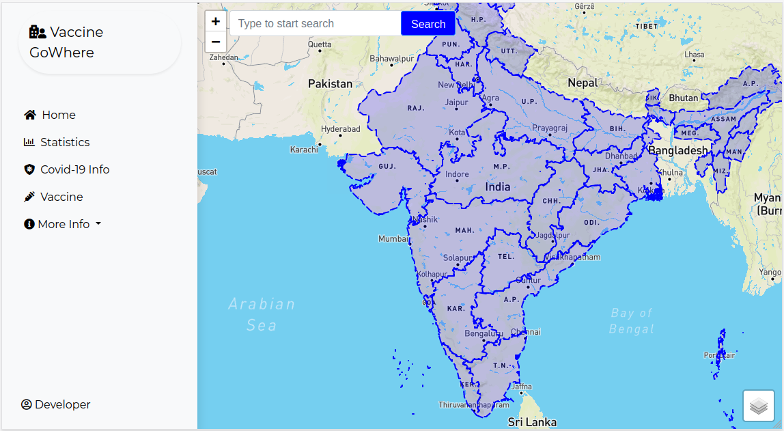

# Interactive Frontend Programming

A screenshot of the landing page of the project.



# Context

This project focuses on an interactive frontend webpage called **Vaccine GoWhere** for finding COVID-19 vaccination centres all over India. There is currently a lack of centralized and accessibile service for booking an appointment for vaccination. It is also difficult to find a single platform that combines the current COVID-19 clusters data together with nearby vaccination centres, so that a user might want to choose an alternate clinic.

This website is therefore designed to bring vaccination appointment booking and current reported cases of COVID-19 infections across India to a centralized platform. The website also aims to provide additional information about the disease and also about vaccines currently approved for use in India.

# Index

1. [UI/UX](#1-uiux)
2. [Technologies Used](#2-technologies-used)
3. [Future Features To Implement](#3-future-features-to-implement)
4. [Testing](#4-testing)
5. [Deployment](#5-deployment)
6. [Credits and Acknoledgement](#6-credits-and-acknoledgement)

# 1. UI/UX

## 1.1 UI

### a. Project Strategy

Several user and organizational goals were considered during the development of this project. A user story-case study was done for selecting the features to be implemented for the project and is summarized below:

| User Stories                                                                                | Features                                                                 |
| :------------------------------------------------------------------------------------------ | :----------------------------------------------------------------------- |
| User want to find location of vaccination centres.                                          | Load vaccination centre as markers on a map.                             |
| User want to search for a specific location to find nearest vaccination centres.            | Add geocoding search feature on the map.                                 |
| User want to view current COVID-19 situation of an area.                                    | Plot a heatmap of daily COVID-19 case number on the map.                 |
| User want to book an appointment for vaccination.                                           | Appointment view and booking page.                                       |
| User want to view information on the disease.                                               | COVID-19 info page.                                                      |
| User want to view information on approved vaccines.                                         | Vaccine page.                                                            |
| User want to view reported infection, recovery, death and vacination numbers in the contry. | Statistics page.                                                         |
| User want information on state-level statistics.                                            | State selection list and rerender of statistics page based on selection. |
| More information is required by the user.                                                   | Read more/Further Info navigation whereever possible.                    |

## 1.2 UX

The project is a professional website that is intented for users looking to book vaccination appointments and also further information on the disease, number of cases and current vaccine information. The fonts chosen for the project is therefore a professional looking font with focus on readability. The colours chosen are also to keep to professional theme with no dark colours as far as possible throughout the project.

### Primary font:

```
  font-family: 'Kaisei Tokumin';
  font-style: normal;
  font-weight: 400;
```

### Secondary font:

```
  font-family: 'Montserrat';
  font-style: normal;
  font-weight: 400;
```

### Prominent colours:

```
#f8f9fa #0000ff #f0f4f7 #212529
```

# 2. Technologies Used

- [HTML5](https://developer.mozilla.org/en-US/docs/Glossary/HTML5)

  The project uses HTML5 to structure the content of the website.

- [CSS](https://developer.mozilla.org/en-US/docs/Web/CSS)

  The project uses CSS to add stylistic touches to the website.

- [Bootstrap v5.0.2](https://getbootstrap.com/docs/5.1/getting-started/introduction/)

  The project uses Bootstrap to structure the layout of the website (e.g. responsive column, containers etc.) and ensure website is mobile responsive.

- [GoogleFonts](https://fonts.google.com/)

  The project uses GoogleFonts to style the typography on the website to enhance the visual experience of users.

- [Font Awesome v5.15.4](https://fontawesome.com/)

  The project uses the icons provided by FontAwesome alongside call-to-action buttons and navigation-menu-items to enhance the user experience by making user interaction with the application more intuitive.

- [Leaflet JS](https://leafletjs.com/)

  This project uses leaflet JS, an open-source JavaScript library for mobile-friendly interactive map. It also uses [Leaflet.MarkerCluster](https://github.com/Leaflet/Leaflet.markercluster) for intractive marker clustering and [leaflet-heatmap](https://leafletjs.com/plugins.html#heatmaps) together with [heatmap.js](https://www.patrick-wied.at/static/heatmapjs/) for plotting interactive heatmaps.

- [Axios](https://github.com/axios/axios)

  This project uses axios JS to handle all API requests.

- [datetime-slot-picker](https://github.com/cyberabis/datetime-slot-picker)

  This project use datetime-slot-picker, a Web Component used for Date and Time Slot Picker. This is a standalone Web Component built using StencilJS.

## 3.1 Additional Features to be implemented in the future

| Number | Feature                                                                           |
| ------ | --------------------------------------------------------------------------------- |
| 1.     | Customised page for appoinment booking for users.                                 |
| 2.     | User account creation and login system to manage vaccination appointment booking. |
| 3.     | Dashbord to view and change current vaccination appointment.                      |
| 4.     | Dynamic data update for Vaccine and Info sections.                                |
| 5.     | Automated email notifications for appointment booking.                            |

## 3.2 Feature fixes to be implemented

1. Fix errors when searching for locations on extreme corners of the country with direct land borders to other countries.

2. Apexchart do not support background rendering. This makes a lot of related chart events useless for single page application. There is also no support for placeholder diaplay while chart is being rendered/data is being loaded. Updating options to any one synchronous charts also update all other charts of the same group - known issue (Refer [link](https://github.com/apexcharts/react-apexcharts/issues/151)). To switch to a more robust chart library in the future.

# 4. Testing

There is no automated testing for this project. A comprehensive manual testing checklist is developed based on user story the pjoject as outlined below:
|Number|Feature|Test|Result|
|---|---|---|---|
|1.|All-Mobile Responsiveness|Test website on small/iPad/large screen sizes in inspector|Pass|
|2.|Cross-browser compatibility|Test project on multiple browser|Pass|
|3.|Load vaccination centre on map|Test marker cluster rendering on multiple browser and screen sizes |Pass|
|4.|Geocoding search on map|Manually search for multiple loactions across India|(i)Partial|
|5.|Heatmap rendering on map|Check heramap rendering on map|Pass|
|6.|Appointment booking system|Book appointmet from multiple vaccination centres on >1 browser and multiple screen sizes|Pass|
|7.|COVID-19 Info Page|View COVID-19 Info page on >1 browser across screen sizes|Pass|
|8.|Vaccine Info Page|View Vaccine Info page on >1 browser across screen sizes|Pass|
|9.|Statistice page|Verify chart rendering on >1 browser and on different screen sizes|Pass|
|10.|State list selection|Verify chart rendering based on state selection on >1 browser and on different screen sizes|Pass|
|11.|Read more/Further Info|Test all Read more/Further Info bottons and verify working as intended|Pass|

(i) Searching for locations on extreme corners of the country with direct land borders to other countries result in errors.

# 5. Deployment

This webpage is currently not deployed. However it can be readily deployed using any of the deployment service providers such as Heroku. For basic viewing, this project can also be run with any live server extenstions from most code editors.

# 6. Credits and Acknoledgement

- [COVID19-India API](#https://data.covid19india.org/) for compiling data and making it openly available for developers.
- [Co-WIN Public APIs](https://apisetu.gov.in/public/marketplace/api/cowin) Government of India public API.
- [Nominatim](https://nominatim.org/) for Open-source geocoding project.
